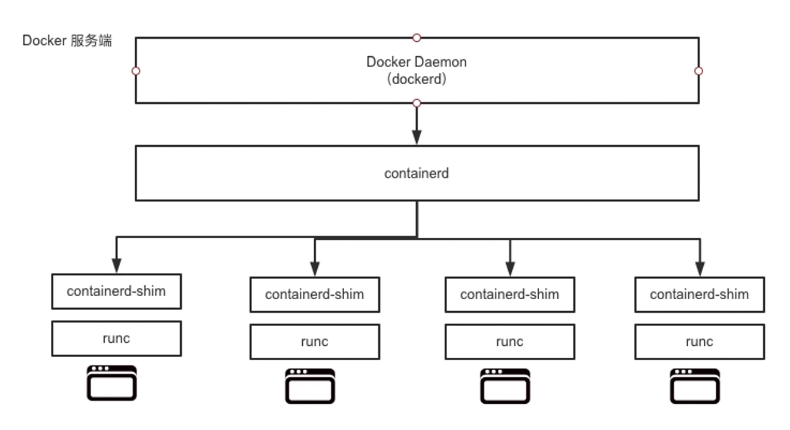

## docker架构

### 1. Docker Client

Docker客户端，Docker引擎提供的CLI工具，用于用户向Docker提交命令请求

### 2. Dockerd

Dockerd即Docker Daemon，主要用来管理docker镜像，容器，网络，卷。通过gRPC与Containerd进行通信

### 3. Containerd

Containerd即Containerd Daemon，主要功能是管理容器的声明周期，不过其本身不会创建容器，而是调用Runc来完成容器的创建。

### 4. Runc

Runc即Run Container，是OCI容器运行时规范的实现，Runc项目的目标之一就是与OCI规范保持一致，所以Runc所在层也称为OCI层，这使得Docker Daemon中不再包含任何容器运行时的代码，简化了Docker Daemon。

Runc只有一个作用就是创建容器，其本质是一个独立的运行时CLI工具，其在fork处一个容器子进程后会启动该容器进程，在容器进程启动完毕后，Runc会自动退出。

### 5. Shim

Shim是实现Daemonless Container不可或缺的工具，使Runc与Daemon解耦，使得Docker Daemon的维护与升级不会影响到运行中的容器。

每次创建容器时，Containerd同时会fork出Runc进程与Shim进程，当Runc自动退出之前，会先将新容器的父进程指定为相应的Shim进程。

除了作为容器的父进程外，Shim还有两个重要功能：

1. 保持所有STDIN与STOUT流的开启状态，从而使得当Docker Daemon重启时，容器不会因为Pipe的关闭而终止
2. 将容器的状态反馈给Docker Daemon

> https://docs.docker.com/get-started/overview/#docker-architecture

