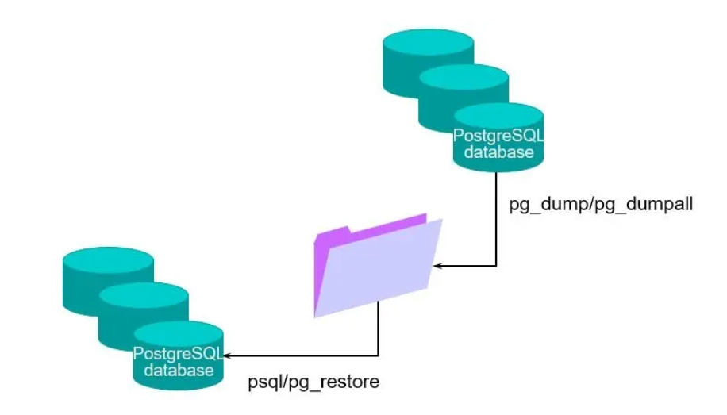

## 逻辑备份工具



导入导出的作用：
1. 归档历史数据
2. 保存表定义以防止用户出错
3. 在计算机和数据库之间或PostgreSQL服务器的不同版本之间移动数据
4. 在数据库之间传输数据

调用导出和导入程序的方法
1. 命令行接口
2. 其它管理工具


## 导出模式

1. pg_dump只能备份单个数据库，不会导出角色和表空间相关的信息，而且恢复的时候需要创建空数据库。
2. pg_dumpall可以备份所有数据库，并且备份角色、表空间。
    - `-F c`备份为二进制格式, 压缩存储. 并且可被pg_restore用于精细还原。
    - `-F p`备份为文本, 大库不推荐。


## pg_dump

语法：

```
pg_dump [选项]... [数据库名字]
```

示例：

```bash
pg_dump testdb > testdb.sql
pg_dump -F c -f testdb.dmp -C -E UTF8 -h 127.0.0.1 -U postgres testdb
pg_dump -F p -f testdb.sql -C -E UTF8 -h 127.0.0.1 -U postgres testdb
```


### 逻辑恢复

恢复顺序：

1.创建新表
2.导入数据
3.建立索引
4.触发器已导入
5.在新表上启用完整性约束
6.创建函数


### 恢复数据

#### 文本格式备份恢复方式：


1.创建新数据库

```
CREATE DATABASE new_db1;
```

2.恢复数据

```bash
psql new_db1 < testdb.sql
```

#### 二进制格式备份恢复方式：

1.创建新数据库

```sql
CREATE DATABASE new_db1;
```

2.恢复数据

```bash
pg_restore -d new_db1 testdb.dmp
```


#### 二进制备份实现精细恢复

利用toc文件实现精细恢复

1.根据二进制备份文件生成 toc 文件

```bash
pg_restore -l -f testdb.toc testdb.dmp
```

2.修改 toc 文件，用';'号注释掉不用还原的内容

```
203; 1259 40996 TABLE public dept postgres
204; 1259 41001 TABLE public emp postgres
;202; 1259 16391 TABLE public t1 postgres
2840; 0 40996 TABLE DATA public dept postgres
2841; 0 41001 TABLE DATA public emp postgres
;2839; 0 16391 TABLE DATA public t1 postgres
```

3.以toc文件做恢复

```bash
pg_restore -F c -L testdb.toc -d testdb testdb.dmp
```

### 其它导出导入技巧


1.利用管道符实现各种导出导入

```bash
# 导出并且压缩:
pg_dump testdb |gzip testdb.sql
# 解压并且导入，压缩文件不变，，导入到testdb数据库：
gunzip -c testdb.sql.gz |psql testdb
# 导出后直接进行恢复，文件不落地，把testdb数据库的表导入到testdb1：
pg_dump testdb| psql testdb1
# 并行导出与导入
pg_dump -Fd -j4 -f testdb.p.dump testdb
pg_restore -d testdb1 -j4 testdb.p.dump
```


### 其它备份恢复技巧

#### 1.备份指定/排除的表

```bash
# 如果只想导出指定的表数据，可以使用-t参数，表名需要用两个双引号概括起来。
pg_dump -t ""departments"" -t ""employees"" testdb > testdb.sql

# 导出排除指定的表的数据库
pg_dump -d testdb -T ""emp"" > testdb_ex_emp.sql
```


#### 2.使用pg_dump实现主机间数据库间迁移数据

文件不落地，实现数据库迁移

1、配置两个数据库之间的信任关系(必须)

```
host all all 192.168.18.0/24 trust
```

2、在数据库之间进行某个数据库迁移

```bash
pg_dump -h pg1 -p 1922 -U postgres testdb|psql -h pg2 -p 5432 -U postgres testdb
```

3、迁移所有的数据库到目标数据库

```bash
pg_dumpall -h pg1 -p 1922 -U postgres |psql -h pg2 -p 5432 -U postgres
```

注意：
1、PG数据库之间迁移无需配置dblink，只要指定主机名和端口即可。
2、由于用的是管道符，所以必须配置两个数据库远程登录信任关系。
3、迁移时两个数据库必须要有相同的表空间，需要提前创建。


## copy概述

实现表与文件之间的交互
copy 命令用于数据库中表与操作系统文件(和标准输出、标准输入)之间的相互拷贝，可以由表至文件，也可以由文件至表。
使用copy实现数据库表和文本文件之间数据的迁移，非常方便，比Oracle的sqlloader易用性好。


### copy语法

· 语法

文件到表

```sql
COPY table_name [ ( column ...] ) ]
FROM { 'filename' | command' | STDIN }
[ [ WITH ] ( option [, ] ) ]
```

表到文件

```sql
COPY { table_name column_name [, ...] ) ] | ( query ) }
TO { 'filename' | PROGRAM 'command' | STDOUT }
[ [ WITH ] ( option [, ...] ) ]
```


### 应用案例

#### 1.文件到表

文件到表时，支持的文本内容格式有两种，一种是tab制表符作为分隔符(不是空格);一种是逗号做为分隔符。

tab键作为分隔符：

```
1 a
2 b
3 c
```

```sql
\copy tab_name from /home/postgres/tab.txt;
```

逗号作为分隔符：

```
1,a,"I am students"
2,b,"I am teacher"
3,c,"I am boss"
```

```sql
\copy tab_name from /home/postgres/tab.csv with csv;
```

#### 2.表到文件

表到文件时，支持的文本内容格式有两种，一种是tab制表符作为分隔符(不是空格);一种是逗号做为分隔符。

tab键作为分隔符：

```sql
\copy tab_name to /home/postgres/tab.txt;
```

逗号做为分隔符：

```sql
\copy tab_name to /home/postgres/tab.csv with csv;
```