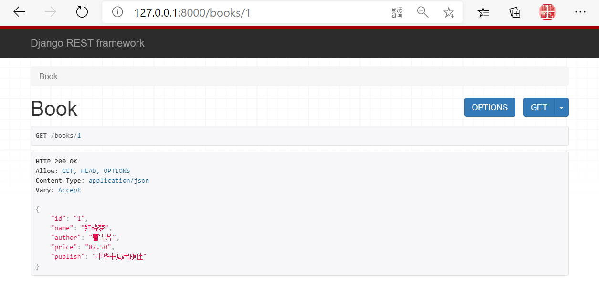
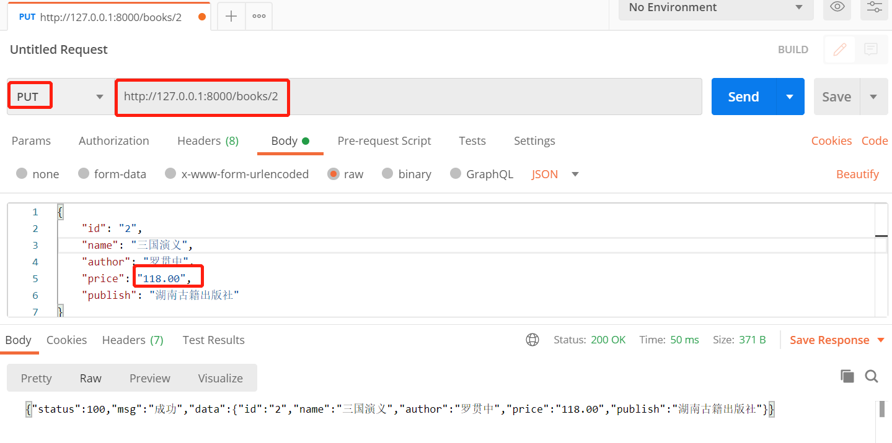
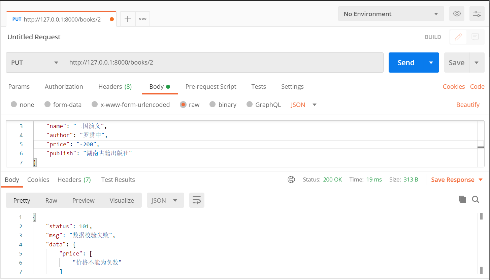

# 一、序列化（Serializers）

## 1. 序列化

1. 序列化：序列化器会把模型对象转换成字典,经过response以后变成json字符串

2. 反序列化：把客户端发送过来的数据,经过request以后变成字典,序列化器可以把字典转成模型

3. 反序列化：完成数据校验功能

## 2. 基本使用

使用流程：

1. 写一个序列化的类，继承`Serializer`

2. 在类中写要序列化的字段，想序列化哪个字段，就在类中写哪个字段

3. 在视图类中使用，导入然后实例化得到序列化类的对象，把要序列化的对象传入

4. `序列化类的对象.data`得到一个字典

5. 把字典返回，如果不使用`rest_framework`的`Response`，就得使用`JsonResponse`

已经准备好的`models.py`

```python
from django.db import models


# Create your models here.

class Book(models.Model):
    id = models.AutoField(primary_key=True)
    name = models.CharField(max_length=32)
    author = models.CharField(max_length=32)
    price = models.DecimalField(max_digits=5, decimal_places=2)
    publish = models.CharField(max_length=32)
```

新建一个`serializes.py`，创建序列化的类

```python
from rest_framework import serializers


class BookSerializer(serializers.Serializer):
    id = serializers.CharField()
    name = serializers.CharField()
    author = serializers.CharField()
    price = serializers.CharField()
    publish = serializers.CharField()
```

在`views.py`写视图

```python
from django.shortcuts import render, HttpResponse

# Create your views here.
from rest_framework.views import APIView
from app.models import Book
from app.serializers import BookSerializer
from rest_framework.response import Response


class BookView(APIView):

    def get(self, request, pk):
        book = Book.objects.filter(id=pk).first()
        book_ser_obj = BookSerializer(book)  # 实例化，序列化谁传谁

        return Response(book_ser_obj.data)  # 序列化以后的字典

```

在`urls.py`注册路由

```python
from django.conf.urls import url
from django.contrib import admin
from app import views

urlpatterns = [
    url(r'^admin/', admin.site.urls),
    url(r'^books/(?P<pk>\d)', views.BookView.as_view()),
]

```



## 3. 常用字段和选项

## 4. 修改数据

使用流程：

1. 写一个序列化的类，继承`Serializer`
2. 在类中写要反序列化的字段，想反序列化哪个字段，就在类中写哪个字段，字段的属性
3. 在视图类中使用：导入2中的序列化类；实例化得到序列化类的对象，把要修改的对象传入，修改的数据传入`book_ser_obj=BookSerializer(instance=book,data=request.data)`
4. 数据校验 `book_ser_obj.is_valid()`
5. 如果校验通过，就保存`book_ser_obj.save()`
6. 如果校验不通过，自己写逻辑处理
7. 如果字段的校验规则不够，可以写钩子函数（局部钩子和全局钩子）
8. 

先`serializes.py`在中重新update方法

```python
class BookSerializer(serializers.Serializer):
    ...
    def update(self, instance, validated_data):
        #instance是book这个对象
        #validated_data是校验后的数据
        instance.name=validated_data.get('name')
        instance.price=validated_data.get('price')
        instance.author=validated_data.get('author')
        instance.publish=validated_data.get('publish')
        instance.save()  #book.save()   django 的orm提供的
        return instance
```

在视图类中写更新方法

```python
class BookView(APIView):
    ...
	def put(self,request,pk):
        response_msg={'status':100,'msg':'成功'}
        # 找到这个对象
        book = Book.objects.filter(id=pk).first()
        # 得到一个序列化类的对象
        # book_ser_obj=BookSerializer(book,request.data)
        book_ser_obj=BookSerializer(instance=book,data=request.data)

        # 要数据验证（回想form表单的验证）
        if book_ser_obj.is_valid():  # 返回True表示验证通过
            book_ser_obj.save()  
            response_msg['data']=book_ser_obj.data
        else:
            response_msg['status']=101
            response_msg['msg']='数据校验失败'
            response_msg['data']=book_ser_obj.errors

        return Response(response_msg)
```



数据校验的钩子函数

局部钩子

```python
from rest_framework import serializers
from rest_framework.serializers import ValidationError

class BookSerializer(serializers.Serializer):
	...
    # 局部钩子
    def validate_price(self, data):  # validate_字段名  接收一个参数
        # 如果价格小于0，就校验不通过
        print(type(data))  # <class 'str'>
        print(data)  # -200
        if float(data) > 0:
            return data
        else:
            # 校验失败，抛异常
            raise ValidationError('价格不能为负数')
```


全局钩子

```python
from rest_framework import serializers
from rest_framework.serializers import ValidationError

class BookSerializer(serializers.Serializer):
	...
    # 全局钩子，校验多个字段
    def validate(self, validate_data):
        name = validate_data.get('name')
        author = validate_data.get('author')
        if ('金瓶梅' in name) or ('张三' in author):
            raise ValidationError('含有敏感词汇')
        else:
            return validate_data
```

## 5.查询所有

新增一个视图

```python
class BooksView(APIView):
    def get(self, request):
        response_msg = {'status': 100, 'msg': '成功'}
        books = Book.objects.all()
        book_ser_obj = BookSerializer(books, many=True)  # 序列化多条,如果序列化一条，不需要写
        response_msg['data'] = book_ser_obj.data
        return Response(response_msg)
```

## 6. 新增

```python
class BooksView(APIView):
    # 新增
    def post(self, request):
        response_msg = {'status': 100, 'msg': '成功'}
        # 修改才有instance，新增没有instance，只有data
        book_ser_obj = BookSerializer(data=request.data)
        # 校验字段
        if book_ser_obj.is_valid():
            book_ser_obj.save() # 需要从写create()
            response_msg['data'] = book_ser_obj.data
        else:
            response_msg['status'] = 102
            response_msg['msg'] = '数据校验失败'
            response_msg['data'] = book_ser_obj.errors
        return Response(response_msg)
```

在序列化类中重新create方法

```python
# serializers.py
from app.views import Book
class BookSerializer(serializers.Serializer):
    def create(self, validated_data):
        instance = Book.objects.create(**validated_data)
        return instance
```

## 7.删除

```python
# views.py
class BookView(APIView):

	...
    def delete(self,request,pk):
        response_msg = {'status': 100, 'msg': '成功'}
        ret = Book.objects.filter(pk=pk).delete()
        return Response(response_msg)
```

补充：

**自己封装Respons对象**

```python
class MyResponse():
    def __init__(self):
        self.status=100
        self.msg='成功'
    @property
    def get_dict(self):
        return self.__dict__

if __name__ == '__main__':
    res=MyResponse()
    res.status=101
    res.msg='查询失败'
    # res.data={'name':'lqz'}
    print(res.get_dict)
```

```python
class BooksView(APIView):

    def get(self,request):
        response=MyResponse()
        books=Book.objects.all()
        book_ser=BookSerializer(books,many=True)  #序列化多条,如果序列化一条，不需要写
        response.data=book_ser.data
        return Response(response.get_dict)
```


## 模型类序列化器

```python
class BookModelSerializer(serializers.ModelSerializer):
    class Meta:
        model=Book  # 对应上models.py中的模型
        # 三种序列化字段的写法
        # 第一种：
        fields='__all__'
        # 第二种：
        # fields=('name','price','id','author')  # 只序列化指定的字段
        # 第三种：
        # exclude=('name',)  # 跟fields不能都写，写谁，就表示排除谁
        
        # 其他参数：
        # read_only_fields=('price',)s
        extra_kwargs = {  # 类似于这种形式name=serializers.CharField(max_length=16,min_length=4)
            'price': {'write_only': True},
        }
        
# 其他使用一模一样
#不需要重写create和updata方法了
```

源码分析：


```python
# source的使用
	1 可以改字段名字  xxx=serializers.CharField(source='title')
    2 可以.跨表publish=serializers.CharField(source='publish.email')
    3 可以执行方法pub_date=serializers.CharField(source='test') test是Book表模型中的方法
    

# SerializerMethodField(）的使用
	1 它需要有个配套方法，方法名叫get_字段名，返回值就是要显示的东西
    authors=serializers.SerializerMethodField() #它需要有个配套方法，方法名叫get_字段名，返回值就是要显示的东西
    def get_authors(self,instance):
        # book对象
        authors=instance.authors.all()  # 取出所有作者
        ll=[]
        for author in authors:
            ll.append({'name':author.name,'age':author.age})
        return ll
```


高级