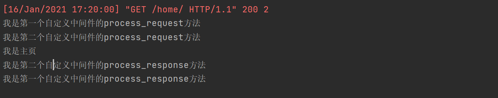
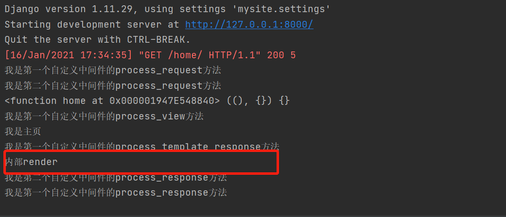

# 中间件

## 一、介绍

django中间件是django的门户

1. 请求来的时候需要先经过中间件才能到达真正的django后端

2. 响应走的时候最后也需要经过中间件才能发送出去

django自带七个中间件，每个中间件都有各自对应的功能

```python
MIDDLEWARE = [
    'django.middleware.security.SecurityMiddleware',
    'django.contrib.sessions.middleware.SessionMiddleware',
    'django.middleware.common.CommonMiddleware',
    'django.middleware.csrf.CsrfViewMiddleware',
    'django.contrib.auth.middleware.AuthenticationMiddleware',
    'django.contrib.messages.middleware.MessageMiddleware',
    'django.middleware.clickjacking.XFrameOptionsMiddleware',
]
```

## 二、自定义中间件

**django支持程序员自定义中间件并且暴露给程序员五个可以自定义的方法：**

1. process_request
2. process_response
3. process_view
4. process_template_response
5. process_exception

### 1. 自定义中间件的流程

1. 在项目名或者应用名下创建一个任意名称的文件夹

2. 在该文件夹内创建一个任意名称的py文件

3. 在该py文件内需要书写类(这个类必须继承MiddlewareMixin)，然后在这个类里面就可以自定义五个方法了（这五个方法并不是全部都需要书写，用几个写几个)。

4. 需要将类的路径以字符串的形式注册到配置文件中才能生效

### 2. 自定义方法

#### 1. process_request

```python
from django.utils.deprecation import MiddlewareMixin


class MyMiddleware1(MiddlewareMixin):
    def process_request(self, request):
        print("我是第一个自定义中间件的process_request方法")


class MyMiddleware2(MiddlewareMixin):
    def process_request(self, request):
        print("我是第二个自定义中间件的process_request方法")
```

视图层

```python
from django.shortcuts import HttpResponse


def home(request):
    print("我是主页")
    return HttpResponse('ok')
```


总结：

1. 请求来的时候需要经过每一个中间件里面的process_request方法，结果的顺序是按照配置文件中注册的中间件从上往下的顺序依次执行。

2. 如果中间件里面没有定义该方法，那么直接跳过执行下一个中间件。

3. 如果该方法返回了HttpResponse对象，那么请求将不再继续往后执行，而是直接原路返回(应用场景：校验失败不允许访问...)

4. process_request方法就是用来做全局相关的所有限制功能

#### 2. process_response

```python
from django.utils.deprecation import MiddlewareMixin


class MyMiddleware1(MiddlewareMixin):
    def process_request(self, request):
        print("我是第一个自定义中间件的process_request方法")

    def process_response(self, request, response):
        print("我是第一个自定义中间件的process_response方法")
        return response


class MyMiddleware2(MiddlewareMixin):
    def process_request(self, request):
        print("我是第二个自定义中间件的process_request方法")

    def process_response(self, request, response):
        print("我是第二个自定义中间件的process_response方法")
        return response
```



总结：

1. 响应走的时候需要结果每一个中间件里面的process_response方法，该方法有两个额外的参数request,response

2. 该方法必须返回一个HttpResponse对象
   - 1.默认返回的就是形参response
   - 2.可以自己返回自己定义的，比如HttpResponse('')

3. 顺序是按照配置文件中注册了的中间件从下往上依次经过，如果没有定义直接跳过执行下一个。
4. 如果在第一个process_request方法就已经返回了HttpResponse对象，那么响应走的时候会直接走同级别的process_reponse返回。

#### 3. process_view

```python
class MyMiddleware1(MiddlewareMixin):
    def process_request(self, request):
        print("我是第一个自定义中间件的process_request方法")

    def process_response(self, request, response):
        print("我是第一个自定义中间件的process_response方法")
        return response

    def process_view(self, request, view_name, *args, **kwargs):
        print(view_name, args, kwargs)
        print("我是第一个自定义中间件的process_view方法")
```


总结：

1. 路由匹配成功之后执行视图函数之前，会自动执行中间件里面的方法
2. 顺序是按照配置文件中注册的中间件从上往下的顺序依次执行

#### 4. process_template_response

```python
class MyMiddleware1(MiddlewareMixin):
    def process_request(self, request):
        print("我是第一个自定义中间件的process_request方法")

    def process_response(self, request, response):
        print("我是第一个自定义中间件的process_response方法")
        return response

    def process_view(self, request, view_name, *args, **kwargs):
        print(view_name, args, kwargs)
        print("我是第一个自定义中间件的process_view方法")

    def process_template_response(self, request, response):
        print("我是第一个自定义中间件的process_template_response方法")
        return response
```

视图层

```python
from django.shortcuts import HttpResponse


def home(request):
    print("我是主页")
    obj = HttpResponse('ok')

    def render():
        print('内部render')
        return HttpResponse('hello')
    obj.render = render
    return obj
```

总结：

1. 返回的HttpResponse对象有render属性的时候才会触发
2. 顺序是按照配置文件中注册了的中间件从下往上依次经过



#### 5. process_exception

```python
    def process_exception(self, request, exception):
        print("我是第一个自定义中间件的process_exception方法")
        return exception
```

总结：

1. 当视图函数中出现异常的情况下触发
2. 顺序是按照配置文件中注册了的中间件从下往上依次经过

## 三、CSRF

### 1. csrf跨站请求伪造校验

网站在给用户返回一个具有提交数据功能页面的时候会给这个页面加一个唯一标识。当这个页面朝后端发送post请求的时候 我的后端会先校验唯一标识，如果唯一标识不对直接拒绝(403 forbbiden)如果成功则正常执行 。

#### 1. 视图函数

```python
from django.shortcuts import HttpResponse, render
from django.views import View


class Login(View):

    def get(self, request):
        return render(request, 'login.html')

    def post(self, request):
        return HttpResponse('login success')
```

#### 2. 路由

```python
from django.urls import path

from app import views

app_name = 'app'
urlpatterns = [
    path('login/', views.Login.as_view()),
]
```

#### 3. 模板文件

```html
<!DOCTYPE html>
<html lang="en">
<head>
    <meta charset="UTF-8">
    <title>登录</title>
      <!--类似于导入模块，可以动态解析配置文件中STATIC_URL的值-->
    <link rel="stylesheet" href="">
    <script src=""></script>
</head>
<body>
<h1 class="text-center">登陆</h1>
<div class="container">
    <div class="row">
        <div class="col-md-8 col-md-offset-2">
            <form action="" method="post">
                <p>username:<input type="text" name="username" class="form-control"></p>
                <p>password:<input type="password" name="password" class="form-control"></p>
                <input type="submit" class="btn btn-success btn-block">
            </form>
        </div>
    </div>
</div>
</body>
</html>
```

在登录页面提交`post`请求时报错


#### 4. 添加`csrf_token`认证

```html
<!DOCTYPE html>
<html lang="en">
<head>
    <meta charset="UTF-8">
    <title>登录</title>
      <!--类似于导入模块，可以动态解析配置文件中STATIC_URL的值-->
    <link rel="stylesheet" href="">
    <script src=""></script>
</head>
<body>
<h1 class="text-center">登陆</h1>
<div class="container">
    <div class="row">
        <div class="col-md-8 col-md-offset-2">
            <form action="" method="post"> 
                  <!--添加认证-->
                <p>username:<input type="text" name="username" class="form-control"></p>
                <p>password:<input type="password" name="password" class="form-control"></p>
                <input type="submit" class="btn btn-success btn-block">
            </form>
        </div>
    </div>
</div>
</body>
</html>
```

页面上会渲染隐藏元素

```html
<input type="hidden" name="csrfmiddlewaretoken" value="hYE9S3sc1Oxs0I2o2eTUJJylwd5WX9rEFXZT45aQ1kfhZ5G1BWkBsAOhHIISGza8">
```


### 2. 校验方式

#### 2.1 表单校验

```django
<form action="" method="post"> 
      <!--添加认证-->
    <p>username:<input type="text" name="username" class="form-control"></p>
    <p>password:<input type="password" name="password" class="form-control"></p>
    <input type="submit" class="btn btn-success btn-block">
</form>
```

#### 2.2 ajax校验

##### 方式一：利用标签查找获取页面上的随机字符串

```javascript
<script>
    $('#btn').click(function () {
        $.ajax({
            url:'',
            type:'post',
            // 利用标签查找获取页面上的随机字符串
            data:{"username":'admin','csrfmiddlewaretoken':$('[name=csrfmiddlewaretoken]').val()},
            success:function () {

            }
        })
    })
</script>
```

##### 方式二：利用模版语法提供的快捷书写

```javascript
<script>
    $('#btn').click(function () {
        $.ajax({
            url:'',
            type:'post',
			// 利用模版语法提供的快捷书写
            data:{"username":'admin','csrfmiddlewaretoken':'{{ csrf_token }}'},
            success:function () {

            }
        })
    })
</script>
```

##### 方式三：导入官方提供的js代码

保存跨域校验js代码到js文件中

```javascript
function getCookie(name) {
    var cookieValue = null;
    if (document.cookie && document.cookie !== '') {
        var cookies = document.cookie.split(';');
        for (var i = 0; i < cookies.length; i++) {
            var cookie = jQuery.trim(cookies[i]);
            // Does this cookie string begin with the name we want?
            if (cookie.substring(0, name.length + 1) === (name + '=')) {
                cookieValue = decodeURIComponent(cookie.substring(name.length + 1));
                break;
            }
        }
    }
    return cookieValue;
}
var csrftoken = getCookie('csrftoken');


function csrfSafeMethod(method) {
  // these HTTP methods do not require CSRF protection
  return (/^(GET|HEAD|OPTIONS|TRACE)$/.test(method));
}

$.ajaxSetup({
  beforeSend: function (xhr, settings) {
    if (!csrfSafeMethod(settings.type) && !this.crossDomain) {
      xhr.setRequestHeader("X-CSRFToken", csrftoken);
    }
  }
});
```

在HTML中导入上述js文件

```javascript
<script src=""></script>
<script>
    $('#btn').click(function () {
        $.ajax({
            url:'',
            type:'post',
			// 直接拷贝js代码并应用到自己的html页面上即可
            data:{"username":'admin'}, 
            success:function () {

            }
        })
    })
</script>
```

### 3. csrf装饰器

```python
from django.views.decorators.csrf import csrf_protect,csrf_exempt

# csrf_protect  需要校验
#    针对csrf_protect符合我们之前所学的装饰器的三种玩法
# csrf_exempt   忽视校验
#    针对csrf_exempt只能给dispatch方法加才有效
```

#### 3.1 FBV装饰

```python
# @csrf_exempt
# @csrf_protect
def transfer(request):
    return render(request,'transfer.html')
```

#### 3.2 CBV装饰

```python
from django.views import View
from django.utils.decorators import method_decorator


# @method_decorator(csrf_protect,name='post')  # csrf_protect 在此处生效
# @method_decorator(csrf_exempt,name='post')  # csrf_exempt 在此处不生效
@method_decorator(csrf_exempt,name='dispatch')
class MyCsrfToken(View):
    # @method_decorator(csrf_protect)  # csrf_protect 在此处生效
    # @method_decorator(csrf_exempt)  # csrf_exempt 在此处生效
    def dispatch(self, request, *args, **kwargs):
        return super(MyCsrfToken, self).dispatch(request,*args,**kwargs)

    def get(self,request):
        return HttpResponse('get')

    # @method_decorator(csrf_protect)  # csrf_protect 在此处生效
    # @method_decorator(csrf_exempt)  # csrf_exempt 在此处不生效
    def post(self,request):
        return HttpResponse('post')
```

