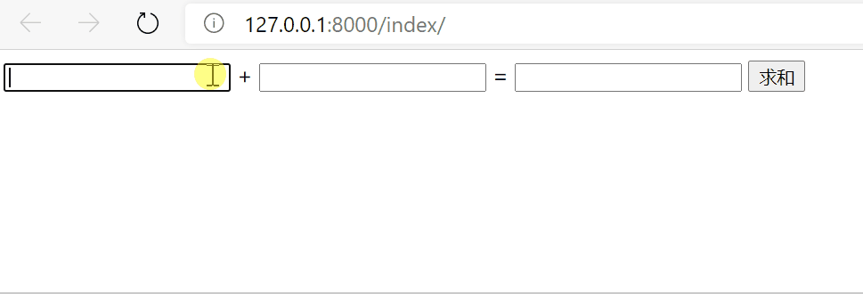

# 视图层

## 1. FBV与CBV

### 1.1 Function-based views

```python
from django.shortcuts import HttpResponse


def index(request):
    return HttpResponse('app Index')
```

### 1.2 Class-based views

编写视图类`app/views.py`

```python
from django.views import View


class Login(View):

    def get(self, request):
        return HttpResponse('get请求')

    def post(self, request):
        return HttpResponse('post请求')

```

路由层`app/urls.py`

```python
from django.urls import path

from app import views

app_name = 'app'
urlpatterns = [
    path('index/', views.index),
    path('login/', views.Login.as_view()),
]
```

#### 1 添加装饰器

##### 方式一：

```python
from django.shortcuts import render, HttpResponse, redirect
from django.views import View


def login_auth(func):
    def inner(request, *args, **kwargs):
        target_url = request.get_full_path()
        if request.COOKIES.get('username'):
            return func(request, *args, **kwargs)
        else:
            return redirect('/login/?redirect=%s' % target_url)

    return inner


class MyLogin(View):
    @method_decorator(login_auth)  # 方式1:直接加在方法上
    def get(self, request):
        return HttpResponse("get请求")

    def post(self, request):
        return HttpResponse('post请求')
```

##### 方式二：

```python
# 可以添加多个针对不同的方法加不同的装饰器
@method_decorator(login_auth,name='post')
@method_decorator(login_auth,name='get')
class MyLogin(View):
    def get(self,request):
        return HttpResponse()

    def post(self,request):
        return HttpResponse()
```

##### 方式三：

```python
class MyLogin(View):
    # 它会直接作用于当前类里面的所有的方法
    @method_decorator(login_auth)
    def dispatch(self, request, *args, **kwargs):
        """
        看CBV源码可以得出 CBV里面所有的方法在执行之前都需要先经过
        dispatch方法(该方法你可以看成是一个分发方法)
        """
        super().dispatch(request, *args, **kwargs)

    def get(self, request):
        return HttpResponse()

    def post(self, request):
        return HttpResponse()
```

## 2. Ajax

`ajax`在不重新加载整个页面的情况下，可以与服务器交换数据并更新部分网页内容。**前后端传输数据的时候一定要确保编码格式跟数据真正的格式一致。**

ajax特点：

1. 异步提交
2. 局部刷新

前后端传输数据的常见编码格式:

1. `x-www-form-urlencoded`
2. `form-data`
3. `json`

前后端传输数据时POST请求的方式：

1. form表单

	- `x-www-form-urlencoded`：前端数据格式：`username=Tom&age=18`，django后端针对符合urlencoded编码格式的数据都会解析封装到request.POST中。
	- `form-data`：普通的键值解析到request.POST中，文件解析到request.FILES中。
	- `json`：form表单是没有办法发送json格式数据的。


2. ajax请求
   - 默认的编码格式也是`x-www-form-urlencoded`

### 5.1 基本使用

模板层

```django
<!DOCTYPE html>
<html lang="en">
<head>
    <meta charset="UTF-8">
    <title>Title</title>
    
    <script src=""></script>
</head>
<body>
<input type="text" id="d1"> +
<input type="text" id="d2"> =
<input type="text" id="d3">
<button id="btn">求和</button>
<script>
    // 先给按钮绑定一个点击事件
    $('#btn').click(function () {
        // 朝后端发送ajax请求
        $.ajax({
            url: '', // 1.指定朝哪个后端发送ajax请求，不写就是朝当前地址提交
            type: 'post', // 2.请求方式，不指定默认就是get
            data: { // 3.数据
                'v1': $('#d1').val(),
                'v2': $('#d2').val()
            },
            success: function (args) { // 4.回调函数:当后端给你返回结果的时候会自动触发 args接受后端的返回结果
                $('#d3').val(args) // 通过DOM操作动态渲染到第三个input里面#}

            }
        })
    })
</script>
</body>
</html>
```

视图层

```python
from django.shortcuts import render, HttpResponse


def index(request):
    if request.method == 'POST':
        v1 = request.POST.get('v1')
        v2 = request.POST.get('v2')
        return HttpResponse(int(v1) + int(v2))  # 要先转int行
    return render(request, 'index.html')
```

效果



### 5.2 ajax发送json格式数据

模板层

```django
<!DOCTYPE html>
<html lang="en">
<head>
    <meta charset="UTF-8">
    <title>Title</title>
    
    <script src=""></script>
</head>
<body>
name:<input type="text" id="name">
<br>
age:<input type="text" id="age">
<br>
<button id="btn">发送</button>
<script>
    // 先给按钮绑定一个点击事件
    $('#btn').click(function () {
        // 朝后端发送ajax请求
        $.ajax({
            url: '',
            type: 'post',
            data: JSON.stringify({
                'name': $('#name').val(),
                'age': $('#age').val()
            }),
            contentType:'application/json',  // 指定编码格式
            success: function () {

            }
        })
    })
</script>
</body>
</html>
```

视图层

```python
from django.shortcuts import render, HttpResponse
import json


def index(request):
    if request.method == 'POST':
        print(request.is_ajax())  # True
        print(request.body)  # 收到二进制的数据：b'{"name":"Tom","age":"18"}'
        # json.loads括号内如果传入了一个二进制格式的数据那么内部自动解码再反序列化
        print(json.loads(request.body))  # {'name': 'Tom', 'age': '18'}
    return render(request, 'index.html')
```

ajax发送json格式数据需要注意点:

1. contentType参数指定成:application/json

2. 数据是真正的json格式数据

3. django后端不会帮你处理json格式数据需要你自己去request.body获取并处理

### 5.3 ajax发送文件

ajax发送文件需要借助于js内置对象FormData。

django后端能够直接识别到formdata对象并且能够将内部的普通键值自动解析并封装到request.POST中，文件数据自动解析并封装到request.FILES中。

模板层

```django
<!DOCTYPE html>
<html lang="en">
<head>
    <meta charset="UTF-8">
    <title>Title</title>
    
    <script src=""></script>
</head>
<body>
<p>name:<input type="text" id="name"></p>
<p>age:<input type="text" id="age"></p>
<p><input type="file" id="myfile"></p>
<button id="btn">发送</button>
<script>
    // 点击按钮朝后端发送普通键值对和文件数据
    $('#btn').on('click', function () {
        // 1 需要先利用FormData内置对象
        let formDateObj = new FormData();  // 可以添加普通键值对，也可以添加文件对象
        // 2 添加普通的键值对
        formDateObj.append('name', $('#name').val());
        formDateObj.append('age', $('#age').val());
        // 3 添加文件对象
        formDateObj.append('myfile', $('#myfile')[0].files[0])
        // 4 将对象基于ajax发送给后端
        $.ajax({
            url: '',
            type: 'post',
            data: formDateObj,  // 直接将对象放在data后面即可

            // ajax发送文件必须要指定的两个参数
            contentType: false,  // 不需使用任何编码，django后端能够自动识别formdata对象
            processData: false,  // 告诉你的浏览器不要对你的数据进行任何处理

            success: function (args) {
            }
        })
    })
</script>
</body>
</html>
```

视图层

```python
from django.shortcuts import render


def index(request):
    if request.is_ajax():
        if request.method == 'POST':
            print(request.POST)  # <QueryDict: {'name': ['Tom'], 'age': ['age']}>
            print(request.FILES)  # <MultiValueDict: {'myfile': [<InMemoryUploadedFile: abc.jpg (image/jpeg)>]}>
    return render(request, 'index.html')
```


