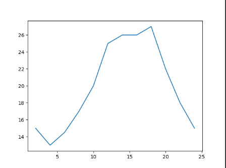
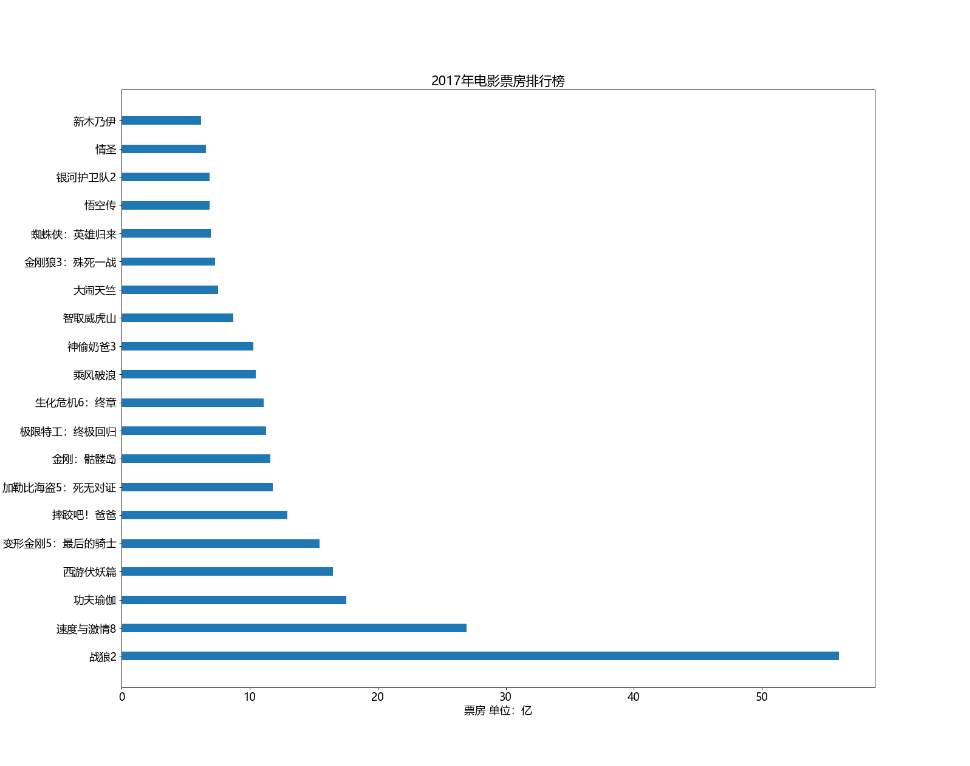
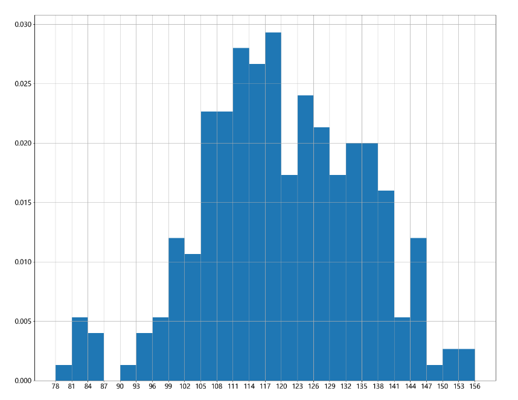

# 数据分析

## 一、matplotlib

1. 能将数据进行可视化，更直观的呈现
2. 使数据更加客观、更具说服力
3. 最流行的Python底层绘图库，主要做数据可视化图表,名字取材于MATLAB，模仿MATLAB构建

### 1. 基本使用

```python
from matplotlib import pylab as plt

x = range(2, 26, 2)  # 数据在x轴的位置 0-24h
y = [15, 13, 14.5, 17, 20, 25, 26, 26, 27, 22, 18, 15]  # 数据在y轴的位置
plt.plot(x, y)  # 绘制折线图
plt.show()  # 展示图形

```



### 2. 设置图形大小和刻度

```python
from matplotlib import pylab as plt

plt.figure(figsize=(20, 8), dpi=80)
# figsize(宽，高)：设置图形大小，单位是英寸； dpi：设置图形每英寸的点数

x = range(2, 26, 2)  # 数据在x轴的位置 0-24h
y = [15, 13, 14.5, 17, 20, 25, 26, 26, 27, 22, 18, 15]  # 数据在y轴的位置

plt.plot(x, y)  # 绘制折线图
plt.xticks(x)  # 把x轴的值全部绘制到图形上
plt.yticks(range(min(y), max(y) + 1))  # 给y轴绘数值
plt.savefig('./tmp.png')  # 保存
plt.show()  # 展示图形

```


### 3. 设置中文字体

```python
from matplotlib import pylab as plt
import matplotlib
# 方式一：
font = {'family': 'Microsoft Yahei',
        'weight': 'bold',
        'size': 16}
matplotlib.rc('font', **font)  # 设置字体，支持中文
# 方式二：
# from matplotlib import font_manager
# font = font_manager.FontProperties(fname=r'C:\Windows\Fonts\STXINGKA.TTF')
# plt.xticks(list(x), x_labels, rotation=45, fontproperties=font)


plt.figure(figsize=(20, 8), dpi=80)

x = range(0, 60, 5)  # 数据在x轴的位置 0-24h
y = [15, 13, 14.5, 17, 20, 25, 26, 26, 27, 22, 18, 15]  # 数据在y轴的位置

plt.plot(x, y)  # 绘制折线图

# 调整x轴的刻度
x_labels = ["10时{}分".format(i) for i in x]

plt.xticks(list(x), x_labels, rotation=45)  # 把x轴的值全部绘制到图形上
# rotation : 设置字旋转角度
plt.yticks(range(min(y), max(y) + 1))  # 给y轴绘数值
plt.show()  # 展示图形

```

### 4. 设置图形信息

```python
from matplotlib import pylab as plt
import matplotlib

font = {'family': 'Microsoft Yahei',
        'weight': 'bold',
        'size': 16}
matplotlib.rc('font', **font)  # 设置字体，支持中文
plt.figure(figsize=(20, 12), dpi=80)

x = range(0, 60, 5)

y = [15, 13, 14.5, 17, 20, 25, 26, 26, 27, 22, 18, 15]  # 数据在y轴的位置
plt.plot(x, y, label="Beijing", color='r', linestyle='--', linewidth=5)  # label 显示图例
# 有几个y轴数据调用几次plot即可

x_labels = ["10时{}分".format(i) for i in x]
plt.xticks(list(x), x_labels, rotation=45)
plt.yticks(range(min(y), max(y) + 1))

# 添加描述信息
plt.xlabel("时间")
plt.ylabel("温度 单位℃")
plt.title("10点每5分钟的气温变化情况")
plt.grid(alpha=0.5)  # 设置网格 alpha：设置透明度
plt.legend(loc="upper left")  # 添加图例  loc: 设置图例的位置
plt.show()

```


### 5. 绘制图形

#### 1. 散点图

```python
from matplotlib import pylab as plt
import matplotlib

font = {'family': 'Microsoft Yahei',
        'weight': 'bold',
        'size': 16}
matplotlib.rc('font', **font)  # 设置字体，支持中文
plt.figure(figsize=(20, 12), dpi=80)

y = [11, 17, 16, 11, 12, 11, 12, 6, 6, 7, 8, 9, 12, 15, 14, 17, 18,
     21, 16, 17, 20, 14, 15, 15, 15, 19, 21, 22, 22, 22, 23]

x = range(1, 32)

plt.scatter(x, y)
plt.show()

```


#### 2. 条形图

使用场景：

1. 数量统计
2. 频率统计

```python
from matplotlib import pylab as plt
import matplotlib

font = {'family': 'Microsoft Yahei',
        'size': 16}
matplotlib.rc('font', **font)  # 设置字体，支持中文
plt.figure(figsize=(20, 16), dpi=80)
a = ["战狼2", "速度与激情8", "功夫瑜伽", "西游伏妖篇", "变形金刚5：最后的骑士", "摔跤吧！爸爸", "加勒比海盗5：死无对证", "金刚：骷髅岛", "极限特工：终极回归", "生化危机6：终章",
     "乘风破浪", "神偷奶爸3", "智取威虎山", "大闹天竺", "金刚狼3：殊死一战", "蜘蛛侠：英雄归来", "悟空传", "银河护卫队2", "情圣", "新木乃伊", ]

b = [56.01, 26.94, 17.53, 16.49, 15.45, 12.96, 11.8, 11.61, 11.28, 11.12, 10.49, 10.3, 8.75, 7.55, 7.32, 6.99, 6.88,
     6.86, 6.58, 6.23]

# 纵向条形图
# plt.bar(a, b, width=0.3)  # width: 设置条形宽度

# 横向条形图
plt.barh(a, b, height=0.3)  # height: 设置条形宽度

plt.ylabel("电影名称")
plt.xlabel("票房 单位：亿")
plt.title("2017年电影票房排行榜")
plt.show()

```



```python
from matplotlib import pylab as plt
import matplotlib

font = {'family': 'Microsoft Yahei',
        'size': 16}
matplotlib.rc('font', **font)  # 设置字体，支持中文
plt.figure(figsize=(20, 16), dpi=80)

a = ["猩球崛起3：终极之战", "敦刻尔克", "蜘蛛侠：英雄归来", "战狼2"]
b_14 = [2358, 399, 2358, 362]
b_15 = [12357, 156, 2045, 168]
b_16 = [15746, 312, 4497, 319]

bar_width = 0.2

x_14 = list(range(len(a)))
x_15 = [i + bar_width for i in x_14]
x_16 = [i + bar_width * 2 for i in x_14]

plt.bar(range(len(a)), b_14, width=bar_width, label="9月14日")
plt.bar(x_15, b_15, width=bar_width, label="9月15日")
plt.bar(x_16, b_16, width=bar_width, label="9月16日")
plt.xticks(x_15, a)
plt.legend()
plt.show()

```


#### 3. 直方图

```python
from matplotlib import pylab as plt
import matplotlib

font = {'family': 'Microsoft Yahei',
        'size': 16}
matplotlib.rc('font', **font)  # 设置字体，支持中文
plt.figure(figsize=(20, 16), dpi=80)

a = [131, 98, 125, 131, 124, 139, 131, 117, 128, 108, 135, 138, 131, 102, 107,
     114, 119, 128, 121, 142, 127, 130, 124, 101, 110, 116, 117, 110, 128, 128,
     115, 99, 136, 126, 134, 95, 138, 117, 111, 78, 132, 124, 113, 150, 110, 117,
     86, 95, 144, 105, 126, 130, 126, 130, 126, 116, 123, 106, 112, 138, 123, 86,
     101, 99, 136, 123, 117, 119, 105, 137, 123, 128, 125, 104, 109, 134, 125, 127,
     105, 120, 107, 129, 116, 108, 132, 103, 136, 118, 102, 120, 114, 105, 115, 132,
     145, 119, 121, 112, 139, 125, 138, 109, 132, 134, 156, 106, 117, 127, 144, 139,
     139, 119, 140, 83, 110, 102, 123, 107, 143, 115, 136, 118, 139, 123, 112, 118,
     125, 109, 119, 133, 112, 114, 122, 109, 106, 123, 116, 131, 127, 115, 118, 112,
     135, 115, 146, 137, 116, 103, 144, 83, 123, 111, 110, 111, 100, 154, 136, 100, 118,
     119, 133, 134, 106, 129, 126, 110, 111, 109, 141, 120, 117, 106, 149, 122, 122, 110,
     118, 127, 121, 114, 125, 126, 114, 140, 103, 130, 141, 117, 106, 114, 121, 114, 133,
     137, 92, 121, 112, 146, 97, 137, 105, 98, 117, 112, 81, 97, 139, 113, 134, 106,
     144, 110, 137, 137, 111, 104, 117, 100, 111, 101, 110, 105, 129, 137, 112, 120, 113,
     133, 112, 83, 94, 146, 133, 101, 131, 116, 111, 84, 137, 115, 122, 106, 144, 109,
     123, 116, 111, 111, 133, 150]

# 组数 = 极差/组距 = (max(a) - min(a)) / width
d = 3  # 组距
num_bins = (max(a) - min(a)) // d
# plt.hist(a, num_bins)
# plt.hist(a, num_bins, density=True)  # density  频率分布直方图
plt.hist(a, range(min(a), max(a) + d, d))  # 如果绘制的图形有偏移，用这种方法
plt.xticks(range(min(a), max(a) + d, d))

plt.grid()
plt.show()

```



## 二、numpy

### 1. 创建数组

```python
import numpy as np

print(np.array([1, 2, 3, 4, 5]))  # [1 2 3 4 5]
print(np.array(range(1, 6)))  # [1 2 3 4 5]
print(np.arange(1, 6, 2))  # [1 3 5]
print(np.arange(1, 6, 2).dtype)  # int32
print(np.array(range(1, 6), dtype='int8').dtype)  # int8  dtype:指定数据类型
t = np.array(range(1, 6), dtype='int8')
t = t.astype('int64')  # 调整数据类型
print(t.dtype)  # int64

# 处理小数
import random
t = np.array([random.random() for _ in range(10)])
print(t.round(2))  # [0.38 0.28 0.75 0.93 0.04 0.29 0.82 0.59 0.12 0.5 ]
print(np.round(t, 2))  # [0.38 0.28 0.75 0.93 0.04 0.29 0.82 0.59 0.12 0.5 ]


t = np.ones((2, 3))  # 2行3列全为1的数组

t = np.zeros((2, 3))  # 2行3列全为0的数组

```

### 2. 数组的形状

```python
import numpy as np
# 二维
t = np.array([[1, 2, 3, 4, 5], [6, 7, 8, 9, 0]])
print(t.shape)  # (2, 5)  2行5列

# 三维
t = np.array([[[1, 2, 3], [4, 5, 6]], [[7, 8, 9], [10,11,12]]])
print(t.shape)  # (2, 2, 3)

print(t.reshape(2, 6))  # 调整数据的形状
```

### 3. 数组和数的计算

```python
import numpy as np

t = np.array([1, 2, 3, 4, 5])
# 数组和数字相加
print(t + 1)  # [2 3 4 5 6]
print(t * 3)  # [ 2  4  6  8 10]
# 数组和数组相加
print(t + t)  # [ 2  4  6  8 10]

```

### 4. 读取文件

```python
np.loadtxt(fname,dtype=np.float,delimiter=None,skiprows=0,usecols=None,unpack=False)

```

| 参数      | 解释                                                         |
| --------- | ------------------------------------------------------------ |
| frame     | 文件、字符串或生产器，可以是.gz或bz2压缩文件                 |
| dtype     | 数据类型，可选。默认np.float                                 |
| delimiter | 分割字符串，默认空格                                         |
| skiprows  | 跳过前x行                                                    |
| usecols   | 读取指定的列，索引，元组类型                                 |
| unpack    | 如果True，读入属性将分别写入不同数组变量，False读入数据只写入一个数组变量，默认False |

```python
# 转置
import numpy as np

t = np.array(range(24)).reshape(4, 6)
print(t)
# [[ 0  1  2  3  4  5]
#  [ 6  7  8  9 10 11]
#  [12 13 14 15 16 17]
#  [18 19 20 21 22 23]]
print(t.T)
print(t.transpose())
print(t.swapaxes(1, 0))
# [[ 0  6 12 18]
#  [ 1  7 13 19]
#  [ 2  8 14 20]
#  [ 3  9 15 21]
#  [ 4 10 16 22]
#  [ 5 11 17 23]]

```

### 5. 索引和切片

```python
import numpy as np

t = np.array(range(24)).reshape(8, 3)

# 取其中一行
print(t[3])  # [ 9 10 11]

# 取连续多行
print(t[3:])

# 取不连续多行
print(t[[1, 2, 5]])

# 取列
print(t[:, 1])  # 取第2列

```

### 6. 修改数值

```python
import numpy as np

t = np.array(range(24)).reshape(8, 3)

# 把小于10的值修改为0
t[t < 10] = 0
print(t)

# 三元运算，把小于10的值改为0，其他改为1
t1 = np.where(t < 10, 0, 1)
print(t1)

# 裁剪
#  小于10的全部改成10，大于18的全部改成18
t1 = t.clip(10, 18)
print(t1)

```

### 7. 拼接

```python
import numpy as np

t1 = np.array(range(12)).reshape(2, 6)
t2 = np.array(range(12)).reshape(2, 6)

print(np.vstack((t1, t2)))  # 竖直拼接
# [[ 0  1  2  3  4  5]
#  [ 6  7  8  9 10 11]
#  [ 0  1  2  3  4  5]
#  [ 6  7  8  9 10 11]]
print(np.hstack((t1, t2)))  # 水平拼接
# [[ 0  1  2  3  4  5  0  1  2  3  4  5]
#  [ 6  7  8  9 10 11  6  7  8  9 10 11]]

```

## 三、pandas

pandas除了处理数值之外(基于numpy)，还能够帮助我们处理其他类型的数据。

1. Series 一维，带标签数组
2. DataFrame 二维，Series容器

### 1. `Series `

#### 1.1 创建

```python
import pandas as pd

t = pd.Series([1, 2, 3, 4, 5])

print(type(t))  # <class 'pandas.core.series.Series'>
print(t)
# 0    1
# 1    2
# 2    3
# 3    4
# 4    5
# dtype: int64

# 指定索引
t = pd.Series([1, 2, 3, 4, 5], index=[list('abcde')])
print(t)
# a    1
# b    2
# c    3
# d    4
# e    5
# dtype: int64

# 通过字典创建

d = {"name": "Tom", "age": 18}
t = pd.Series(d)
print(t)
# name    Tom
# age      18
# dtype: object

```

#### 1.2 索引和切片

```python
import pandas as pd

d = {"name": "Tom", "age": 18}
t = pd.Series(d)
print(t[1])  # 18
print(t['name'])  # Tom
print(t[['name', 'age']])
# name    Tom
# age      18
# dtype: object

```

### 2. `DataFrame`

#### 2.1 创建

```python
import pandas as pd
import numpy as np

t = pd.DataFrame(np.arange(12).reshape(3, 4), index=list('abc'), columns=list("ABCD"))
print(t)
#    0  1   2   3
# 0  0  1   2   3
# 1  4  5   6   7
# 2  8  9  10  11


# 通过字典创建
# 方式一
d = {"name": ["Tom", "Jerry"], "age": [18, 16]}
t = pd.DataFrame(d)
print(t)
#     name  age
# 0    Tom   18
# 1  Jerry   16

# 方式二
l = [{"name": "Tom", "age": 18}, {"name": "Jerry", "age": 16}]
t = pd.DataFrame(l)
print(t)
#     name  age
# 0    Tom   18
# 1  Jerry   16
```

#### 2.2 基础属性

```python
In [1]: import pandas as pd

In [2]: d = {"name": ["Tom", "Jerry"], "age": [18, 16]}

In [3]: t = pd.DataFrame(d)

In [4]: t.shape
Out[4]: (2, 2)

In [5]: t.dtypes
Out[5]:
name    object
age      int64
dtype: object

In [6]: t.ndim
Out[6]: 2

In [7]: t.index
Out[7]: RangeIndex(start=0, stop=2, step=1)

In [8]: t.columns
Out[8]: Index(['name', 'age'], dtype='object')

In [9]: t.values
Out[9]:
array([['Tom', 18],
       ['Jerry', 16]], dtype=object)

In [10]: t.head(1)  # 显示头部几行，默认5行
Out[10]:
  name  age
0  Tom   18

In [11]: t.tail(1)  # 显示尾部部几行，默认5行
Out[11]:
    name  age
1  Jerry   16

In [12]: t.info()  # 显示相关信息概览
<class 'pandas.core.frame.DataFrame'>
RangeIndex: 2 entries, 0 to 1
Data columns (total 2 columns):
 #   Column  Non-Null Count  Dtype
---  ------  --------------  -----
 0   name    2 non-null      object
 1   age     2 non-null      int64
dtypes: int64(1), object(1)
memory usage: 160.0+ bytes
    
In [13]: t.describe()   # 快速综合统计结果：计数，均值，标准差，四分位数，最小值，最大值
Out[13]:
             age
count   2.000000
mean   17.000000
std     1.414214
min    16.000000
25%    16.500000
50%    17.000000
75%    17.500000
max    18.000000
    
```

#### 2.3 基础方法

```python
import pandas as pd

d = {"name": ["Tom", "Jerry"], "age": [18, 16]}
t = pd.DataFrame(d)

# 排序
print(t.sort_values(by='age'))
```

#### 2.4 索引

```python
import pandas as pd

d = {"project": ["Django", "Flask", "Fastapi", "Tornado", "Bottle"], "star": [58234, 55953, 32574, 20134, 7351]}
t = pd.DataFrame(d)

print(t[:3])  # 前3行
print(t[:3]['star'])  # 前3行star列
print(t['project']) # 取列


# df.loc 通过标签索引行数据
# df.iloc 通过位置获取行数据

t = pd.DataFrame(np.arange(12).reshape(3, 4), index=list('abc'), columns=list("WZYX"))
print(t.loc['a'])  # 取某一行
# W    0
# Z    1
# Y    2
# X    3
# Name: a, dtype: int32

print(t.loc[:, "Y"])  # 取某一列
# a     2
# b     6
# c    10
# Name: Y, dtype: int32

print(t.loc['a', "Z"])  # 1
print(t.loc['a':'c', "Z"])  # 需要注意的是：冒号在loc里是闭合的
# a    1
# b    5
# c    9
# Name: Z, dtype: int32


# 布尔索引
d = {"project": ["Django", "Flask", "Fastapi", "Tornado", "Bottle"], "star": [58234, 55953, 32574, 20134, 7351]}
t = pd.DataFrame(d)

print(t[t['star'] > 30000])
#    project   star
# 0   Django  58234
# 1    Flask  55953
# 2  Fastapi  32574


# 多条件 & | ，不同的条件之间要用括号括起来。
print(t[(t['star'] < 30000) & (t['star'] > 20000)])
#    project   star
# 3  Tornado  20134
```


### 3. 读取外部数据

```python
import pandas as pd

df = pd.read_csv("filename.csv")
```

