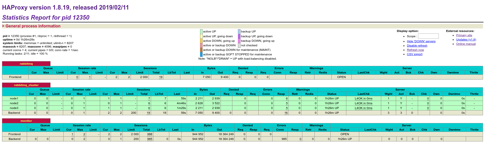

## 一、基础知识

### 1. 消息中间件

#### 1. 消息与消息队列中间件

**消息**：消息是指应用间传送的数据，可以是字符串，JSON，内嵌对象等

**消息中间件**：是指利用高效可靠额消息传递机制进行与平台无关的数据交流，并基于数据通信来进行分布式系统集成。

#### 2. 消息传递模式

1. 点对点：消息生产者生产消息发送到queue中，然后消息消费者从queue中取出并且消费消息
2. 发布/订阅：使用topic作为通信载体 

#### 3.主流产品

Rabbitmq、Kafka、ActiveMQ、RocketMQ

#### 4. 消息中间件的作用

1. 解耦
2. 冗余（存储）：把数据持久化直到数据被处理完
3. 扩展性
4. 削峰：使关键组件支撑突发访问压力
5. 可恢复性
6. 顺序保证：保证数据处理的顺序
7. 缓冲
8. 异步通信

### 2. Rabbitmq

#### 1. 官网

http://www.rabbitmq.com/

#### 2. 特点

1. 可靠性： 持久化、传输确认、发布确认
2. 灵活的路由
3. 扩展性：集群
4. 高可用性： 集群镜像
5. 多种协议：AMQP、STOMP、MQTT
6. 多语言客户端：Python、Java、Ruby、PHP、C#、JavaScript、Go、Elixir、Objective-C、Swift、Spring AMQP
7. 管理界面
8. 插件机制

#### 3. 概念

##### 1. Producer

生产者，投递消息的一方，消息的组成：

1. 消息体：带有业务逻辑结构的数据（如JSON）
2. 标签：交换器名称或路由键

##### 2. Consumer

消费者，接收消息的一方，消费一条消息时只消费消息体，消息的标签在路由的过程中会丢弃

##### 3. Broker

消息中间件的服务节点，可以简单的看作一个Rabbitmq服务节点或者Rabbitmq服务实例

##### 4. Queue

队列，Rabbitmq的内部对象，用来存储消息。

多个消费者可以订阅同一个队列，队列中的消息会轮询给多个消费者进行处理。

##### 5. Exchange

交换器，生产者将消息发送到交换器，由交换器将消息路由到一个或多个队列中。

交换器类型：

1. fanout： 把所有发送到该交换器的消息路由到所有与该交换器绑定的队列中

2. direct： 把消息路由到BindingKey和RoutingKey完全匹配的队列中

3. topic：把消息路由到BindingKey和RoutingKey匹配（可以模糊匹配）的队列中

```
匹配规则：
1. routing key为一个句点号“.”分隔的字符串（我们将被句点号“.”分隔开的
每一段独立的字符串称为一个单词），如“stock.usd.nyse”、“nyse.vmw”、
“quick.orange.rabbit”
2.binding key与routing key一样也是句点号“.”分隔的字符串
3.binding key中可以存在两种特殊字符“*”与“#”，用于做模糊匹配，其中“*”
用于匹配一个单词，“#”用于匹配多个单词（可以是零个）
```

4. headers: 根据消息内容中header（键值对形式）属性进行匹配
   性能较差，而且不实用


##### 6.RoutingKey

路由键，生产者将消息发给交换器的时候，一般会指定一个RoutingKey，用来指定这个消息的路由规则，；路由键需要与
交换器类型和绑定键联合使用才能生效


##### 7. Binding

绑定，绑定可以将交换器与队列关联起来

##### 8. Connection

连接，消费者/生产者与Rabbitmq Broker建立的TCP连接

##### 9. Channel

信道，建立在Connection上的虚拟连接

#### 4. 工作流程

##### 1. 生产者发送消息

1. 生产者连接到Rabbitmq Broker，建立一个连接，开启一个信道(Channel)
2. 生产者声明一个交换器，并设置相关属性，比如交换机类型、是否持久化等
3. 生产者声明一个队列并设置相关属性，比如是否拍他，是否持久化，是否自动删除等
4. 生产者通过路由键将交换器和队列绑定起来
5. 生产者发送消息到Rabbitmq Broker，其中包括路由键、交换器等
6. 相应的交换器根据接收到的路由键查找相匹配的队列
7. 如果找到，则将从生产者发送过来的消息存入到相应的队列中，未找到则根据生产者配置的属性
   选择丢弃还是退回给生产者
8. 关闭信道
9. 关闭连接

##### 2. 消费者接收消息

1. 消费者连接到Rabbitmq Broker， 建立一个连接，开启一个信道
2. 消费者向Rabbitmq Broker请求消费相应队列中的消息，可能会设置相应的回调函数，以
   及一些准备工作
3. 等待Rabbitmq Broker回应并投递相应队列中的消息
4. 消费者确认接收到的消息、
5. Rabbitmq从队列中删除已经被确认的消息
6. 关闭信道
7. 关闭连接

### 3. AMQP协议

AMQP协议包括三层

1. Module Layer：位于协议最高层，主要定义了一些提供给客户端调用的命令，客户端可
   以利用这些命令实现自己的业务逻辑。
2. Session Layer：位于中间层，主要负责将客户端的命令发送给服务器，再将服务器端的
   应答返回给客户端，主要为客户端与服务器直接的通信提供可高性同步机制和错误处理
3. Transport Layer：位于最底层，主要传输二进制数据流，提供帧的处理、信道复用、错
   误检测和数据表示

## 二、使用

安装pika

```bash
pip install pika
```

以容器方式启动一个rabbitmq

```bash
$ docker run -it --name rabbitmq -p 5672:5672 -p 15672:15672 -p 25672:25672 rabbitmq:3.6.12
```

### 1. Hello Word

1. 生产者

```python
import pika

# 建立TCP连接
connection = pika.BlockingConnection(pika.ConnectionParameters('localhost'))
# 建立一个信道
channel = connection.channel()
# 创建一个队列
channel.queue_declare(queue='hello')
# 创建一个交换机
channel.basic_publish(exchange='',routing_key='hello',body='Hello World!')
print(" [×] Sent 'Hello World!'")
# 关闭连接
connection.close()
```

查看rabbitmq中的队列

```bash
$ docker exec  -it  rabbitmq  bash
root@f6d1cc085307:/# rabbitmqctl list_queues
Listing queues
hello	1
```

2. 消费者

```python
import pika

connection = pika.BlockingConnection(pika.ConnectionParameters(host='localhost')
channel = connection.channel()
# 一次再建立队列。官方建议在消费和生产者都声明建立一个队列
channel.queue_declare(queue='hello')
# 定义一个回调函数来处理消息，函数格式固定
def callback(ch, method, properties, body):
    print("[×] Receive %r" % body)
# 定义从哪个队列接收消息以及处理消息的函数
channel.basic_consume(callback,
                      queue='hello',
                      no_ack=True)

print('[*] Waiting for messages. To exit press CTRL+C')
# 开始处理消息
channel.start_consuming()
```

执行结果

```bash
$python3 send.py
[×] Sent 'Hello World!'
$ python3 receive.py 
[*] Waiting for messages. To exit press CTRL+C
[×] Receive b'Hello World!'
```

### Queue 队列

队列的作用：

想象一个场景，如果生产者产生许多需要花很多时间处理的数据和任务，采用BIO的模式
交给消费者处理的话，生产者需要等很长时间直到消费者处理完消息再继续发送下一个消息。
有了队列以后生产者只需要把数据扔到队列中就可以了，消费者定期从队列中取数据进行处
理（消费）。处理完一个再从队列中取下一个进行处理。如果数据处理的时间太长，我们可
以多建几个消费者一起消费数据。默认情况下，rabbitmq以轮询的方式把消息分发给消费者。

#### 1. 消息确认

在之前的代码中，一旦rabbitmq把消息发给消费者就会把消费标记为删除，如果此时消费者
挂了，消息就会丢失，我们希望如果因为一个消费者挂了而把没有没有处理的消息交给另一
个消费者处理。为了保证数据不丢失，rabbitmq使用消息确认机制保证数据不丢失。消费者
如果处理完消息会给rabbitmq发送一个ack。

如果消费者挂了（TCP连接端口，信道关闭），没有发送ack，rabbitmq就认为消息没有处理
然后把消息交给其他消费者去处理。


更改后的代码

生产者

```python
import pika
import sys

# 建立TCP连接
connection = pika.BlockingConnection(pika.ConnectionParameters('localhost'))
# 建立一个信道
channel = connection.channel()
# 创建一个队列
channel.queue_declare(queue='hello')
# 定义消息内容
message = ' '.join(sys.argv[1:]) or "Hello World!"

# 创建一个交换机
channel.basic_publish(exchange='',routing_key='hello',body=message)
print(" [×] Sent %r" % message)
# 关闭连接
connection.close()
```

消费者

```python
import pika
import time
connection = pika.BlockingConnection(pika.ConnectionParameters(host='localhost'))
channel = connection.channel()
# 一次再建立队列。官方建议在消费和生产者都声明建立一个队列
channel.queue_declare(queue='hello')
# 定义一个回调函数来处理消息，函数格式固定
def callback(ch, method, properties, body):
    print("[×] Receive %r" % body)
    # 计算消息长度来模拟消费者处理消息需要的时间
    time.sleep(len(body))
    print("[×] Done")
    # 确认消息已经被处理
    ch.basic_ack(delivery_tag = method.delivery_tag)

# 定义从哪个队列接收消息以及处理消息的函数
channel.basic_consume(callback,
                      queue='hello')
print('[*] Waiting for messages. To exit press CTRL+C')
# 开始处理消息
channel.start_consuming()
```

测试

开第1个shell发送消息

```bash
# 发送一个消息
$ python3 send.py
[×] Sent 'Hello World!'
```

开第2个shell处理消息，消息没处理完直接结束进行

```bash
# 消息还没有处理完的时候把进程结束掉
$ python3 receive.py 
[*] Waiting for messages. To exit press CTRL+C
[×] Receive b'Hello World!'
^CTraceback (most recent call last):
...
```

开第3个shell继续处理消息
	

```bash
# 消息被转到另个一消费者进行处理
$ python3 receive.py 
[*] Waiting for messages. To exit press CTRL+C
[×] Receive b'Hello World!'
[×] Done
```

查看未被确认的消息

```bash
$ rabbitmqctl list_queues name messages_ready messages_unacknowledged
Listing queues
hello	0	5
```

#### 2. 消息持久化

默认情况下，rabbitmq退出之后队列和消息就会丢失。为了保证数据不丢失需要做数据持久化。

队列持久化

```python
channel.queue_declare(queue='hello', durable=True)
```

消息持久化

```python
channel.basic_publish(exchange='',
                      routing_key="task_queue",
                      body=message,
                      properties=pika.BasicProperties(
                      delivery_mode = 2, # make message persistent
                      ))
```


#### 3. 公平分发

普通的轮询策略可能会导致负载不均衡。Fair dispatch有点加权轮询的意思，把消息分发
给不太忙的消费者

使用basic.qos模式令prefetch_count=1。让消费者告诉Rabbitmq，在当前的消息处理完毕
并确认之前不要再发消息

最终代码

生产者

```python
#!/usr/bin/env python
import pika
import sys

connection = pika.BlockingConnection(pika.ConnectionParameters(host='localhost'))
channel = connection.channel()

channel.queue_declare(queue='task_queue', durable=True)

message = ' '.join(sys.argv[1:]) or "Hello World!"
channel.basic_publish(exchange='',
                      routing_key='task_queue',
                      body=message,
                      properties=pika.BasicProperties(
                         delivery_mode = 2, # make message persistent
                      ))
print(" [x] Sent %r" % message)
connection.close()
```

消费者

```python
#!/usr/bin/env python
import pika
import time

connection = pika.BlockingConnection(pika.ConnectionParameters(host='localhost'))
channel = connection.channel()

channel.queue_declare(queue='task_queue', durable=True)
print(' [*] Waiting for messages. To exit press CTRL+C')

def callback(ch, method, properties, body):
    print(" [x] Received %r" % body)
    time.sleep(len(body))
    print(" [x] Done")
    ch.basic_ack(delivery_tag = method.delivery_tag)

channel.basic_qos(prefetch_count=1)
channel.basic_consume(callback,
                      queue='task_queue')

channel.start_consuming()
```


### 3. 分发与订阅

#### 1. 交换器

1. 交换器从生产者那里就收数据，然后推送的队列
2. 交换器觉得消息是分发给指定队列，还是多个队列，还是丢弃
3. 交换器的类型：direct、topic、fanout、header 


#### 2. 临时队列

用完之后就删除，官方文档以记录日志的实例说明。

1. 使用fanout交换器，消费者要接收所有的日志消息，
2. 消费者想要接收的消息是最新的消息流而不是旧的。

为了达到这个目的，需要干两件事：

1. 无论什么时候连接rabbitmq时，需要一个新的、空的队列-->创建一个随机队列
2. 一旦消费者断开连接，就删除这个队列

最终代码

```python
import pika
import sys

# 建立TCP连接
connection = pika.BlockingConnection(pika.ConnectionParameters('localhost'))
# 建立一个信道
channel = connection.channel()
# 建立一个交换器，交换器的类型为fanout
channel.exchange_declare(exchange='logs',
                        exchange_type='fanout')

# 定义消息内容
message = ' '.join(sys.argv[1:]) or "Hello World!"

# 创建一个交换机
channel.basic_publish(exchange='logs',
                     routing_key='',   # 在fanout模式下，路由键被忽略
                     body=message)
print(" [×] Sent %r" % message)
# 关闭连接
connection.close()

```


```python
import pika
import time
connection = pika.BlockingConnection(pika.ConnectionParameters(host='localhost'))
channel = connection.channel()
channel.exchange_declare(exchange='logs',
                        exchange_type='fanout')

# 消费完之后删除队列
result = channel.queue_declare(exclusive=True)

# 生成一个随机队列
queue_name = result.method.queue

channel.queue_bind(exchange='logs',
                   queue=queue_name)

print('[*] Waiting for messages. To exit press CTRL+C')
# 定义一个回调函数来处理消息，函数格式固定
def callback(ch, method, properties, body):
    print("[×] Receive %r" % body)

# 定义从哪个队列接收消息以及处理消息的函数
channel.basic_consume(callback,
                      queue=queue_name,
                      no_ack=True)


# 开始处理消息
channel.start_consuming()

```

```bash
# rabbitmqctl list_bindings
Listing bindings
	exchange	amq.gen-gFj_8p_zIA4a2rpIpTSYcA	queue	amq.gen-gFj_8p_zIA4a2rpIpTSYcA	[]
logs	exchange	amq.gen-gFj_8p_zIA4a2rpIpTSYcA	queue	amq.gen-gFj_8p_zIA4a2rpIpTSYcA	[]

```


### 4. 路由

#### 1. Binging

绑定把交换器和队列关联起来，队列可以从交换器那里只接收自己“感兴趣”的消息

#### 2. Direct 交换器

fanout 交换器会“无脑”的把消息广播给每个消费者，但是有时候我们并不需要所有的消息
比如上面的log例子中，假如消费者只想接收错误日志时就需要用direct 交换器来实现了

最终代码

生产者

```python
mport pika
import sys

connection = pika.BlockingConnection(pika.ConnectionParameters('localhost'))
channel = connection.channel()

channel.exchange_declare(exchange='logs',
                        exchange_type='direct')

# 定义日志级别
severity = sys.argv[1] if len(sys.argv) > 1 else 'info'
# 消息内容
message = ' '.join(sys.argv[2:]) or "Hello World!"

# 创建一个交换机
channel.basic_publish(exchange='logs',
                     routing_key=severity,   # 在fanout模式下，路由键被忽略
                     body=message)

print(" [×] Sent %r:%r" % (severity, message))
connection.close()


```

消费者

```python
import pika
import sys
connection = pika.BlockingConnection(pika.ConnectionParameters(host='localhost'))
channel = connection.channel()
channel.exchange_declare(exchange='logs',
                        exchange_type='direct')

# 消费完之后删除队列
result = channel.queue_declare(exclusive=True)
# 生成一个随机队列
queue_name = result.method.queue

# 消费者接收日志的级别
severities = sys.argv[1:] 
if not severities:
    sys.stderr.write("Usage: %s [info] [warning] [error]\n" % sys.argv[0])


for severity in severities:
    channel.queue_bind(exchange='logs',
                       queue=queue_name,
                       routing_key=severity)

print('[*] Waiting for messages. To exit press CTRL+C')
# 定义一个回调函数来处理消息，函数格式固定
def callback(ch, method, properties, body):
    print("[×] %r:%r" % (method.routing_key, body))

# 定义从哪个队列接收消息以及处理消息的函数
channel.basic_consume(callback,
                      queue=queue_name,
                      no_ack=True)

channel.start_consuming()

```

验证：

开四个窗口，一个发送，三个接收

shell 1

```bash
# 第一次发送info级别的日志
$ python3 send.py info hello
 [×] Sent 'info':'hello'
# 第二次发送warning级别的日志
$ python3 send.py warning world
 [×] Sent 'warning':'world'

```

shell 2

```bash
# 只接收info级别日志级别的消费者都收到日志
$ python3 receive.py info
[*] Waiting for messages. To exit press CTRL+C
[×] 'info':b'hello'

```

shell 3

```bash
# 只就收warning级别日志的消费者只收到第二次发送的消息
$ python3 receive.py warning
[*] Waiting for messages. To exit press CTRL+C
[×] 'warning':b'world'

```

shell 4

```bash
# 只接收info级别日志级别的消费者都收到日志
$ python3 receive.py info
[*] Waiting for messages. To exit press CTRL+C
[×] 'info':b'hello'

```

### 5. 主题


### 6. RPC

## 三、运维

### 1.安装

#### 1. 编译安装

##### 1.1. 安装编译工具

```bash
$ sudo apt update
$ sudo apt install gcc make
```

##### 1.2. 安装ncurses

```bash
$ wget http://ftp.gnu.org/gnu/ncurses/ncurses-6.1.tar.gz
$ tar zxf ncurses-6.1.tar.gz
$ cd ncurses-6.1
$ ./configure
$ make
$ sudo make install
```

##### 1.3. 安装openssl

```bash
$ wget https://www.openssl.org/source/old/1.0.2/openssl-1.0.2p.tar.gz
$ sudo mkdir /usr/local/openssl
$ tar zxf openssl-1.0.2p.tar.gz
$ cd openssl-1.0.2p/
$ ./config --prefix=/usr/local/openssl
#新版本openssl默认编译出来的libcrypto.a是没有加-fPIC参数的，当重定位被引用的代码
#段数据对象时出错。
#修改openssl源码的Makefile
#参考：https://blog.csdn.net/erlib/article/details/20995947
#在CFLAG=　添加　-fPIC
$ vi Makefile
CC= gcc
CFLAG= -fPIC ...
$ make
$ sudo make install
```

##### 1.4. 安装erlang环境

```bash
#下载erlang：http://www.erlang.org/downloads/19.3
#安装指南：http://erlang.org/doc/installation_guide/INSTALL.html

$ wget http://erlang.org/download/otp_src_19.3.tar.gz
$ tar zxf otp_src_19.3.tar.gz
$ sudo mkdir /usr/local/erlang
$ cd otp_src_19.3/
$ ./configure --prefix=/usr/local/erlang/ --with-ssl=/usr/local/openssl
$ make && sudo make install
```

##### 1.5. 安装rabbitmq

```bash
# rabbitmq下载地址：http://www.rabbitmq.com/releases/rabbitmq-server/
# 下载需要安装的版本：
$ wget http://www.rabbitmq.com/releases/rabbitmq-server/v3.6.12/rabbitmq-server-generic-unix-3.6.12.tar.xz
$ tar xJf rabbitmq-server-generic-unix-3.6.12.tar.xz
$ sudo mv rabbitmq_server-3.6.12 /usr/local/rabbitmq
```

##### 1.6. 配置环境变量

```bash
$ cat /etc/profile
export ERLANG_HOME=/usr/local/erlang
export PATH=$ERLANG_HOME/bin:$PATH
export RABBITMQ_HOME=/usr/local/rabbitmq
export PATH=$RABBITMQ_HOME/sbin:$PATH
$ source  /etc/profile
```

##### 1.7. 启动服务

```bash
$ rabbitmq-server -detached
Warning: PID file not written; -detached was passed.  # 使用-detached不会生产pid文件
# 查看rabbitmq状态
$ rabbitmqctl status
Status of node rabbit@node1
[{pid,2162},
 {running_applications,
     [{rabbit,"RabbitMQ","3.6.12"},
      {mnesia,"MNESIA  CXC 138 12","4.14.3"},
      {ranch,"Socket acceptor pool for TCP protocols.","1.3.0"},
      {ssl,"Erlang/OTP SSL application","8.1.1"},
      {public_key,"Public key infrastructure","1.4"},
      {asn1,"The Erlang ASN1 compiler version 4.0.4","4.0.4"},
      {rabbit_common,
          "Modules shared by rabbitmq-server and rabbitmq-erlang-client",
          "3.6.12"},
      {syntax_tools,"Syntax tools","2.1.1"},
      {os_mon,"CPO  CXC 138 46","2.4.2"},
      {crypto,"CRYPTO","3.7.3"},
      {xmerl,"XML parser","1.3.13"},
      {compiler,"ERTS  CXC 138 10","7.0.4"},
      {sasl,"SASL  CXC 138 11","3.0.3"},
      {stdlib,"ERTS  CXC 138 10","3.3"},
      {kernel,"ERTS  CXC 138 10","5.2"}]},
 {os,{unix,linux}},
 {erlang_version,
     "Erlang/OTP 19 [erts-8.3] [source] [64-bit] [async-threads:64] [kernel-poll:true]\n"},
 {memory,
     [{connection_readers,0},
      {connection_writers,0},
      {connection_channels,0},
      {connection_other,0},
      {queue_procs,2600},
      {queue_slave_procs,0},
      {plugins,0},
      {other_proc,22505384},
      {metrics,42216},
      {mgmt_db,0},
      {mnesia,58288},
      {other_ets,1946128},
      {binary,52272},
      {msg_index,41080},
      {code,21412394},
      {atom,891849},
      {other_system,18227437},
      {total,65179648}]},
 {alarms,[]},
 {listeners,[{clustering,25672,"::"},{amqp,5672,"::"}]},
 {vm_memory_calculation_strategy,rss},
 {vm_memory_high_watermark,0.4},
 {vm_memory_limit,416343654},
 {disk_free_limit,50000000},
 {disk_free,6662619136},
 {file_descriptors,
     [{total_limit,924},{total_used,2},{sockets_limit,829},{sockets_used,0}]},
 {processes,[{limit,1048576},{used,151}]},
 {run_queue,0},
 {uptime,176},
 {kernel,{net_ticktime,60}}]
```

以这种方式启动时，当前节点以rabbit@主机名来命令。
指定节点名的方法

```bash
$ RABBITMQ_NODENAME=rabbit@名称 rabbitmq-server -detached
```

#### 2. 网络源安装

略

### 2. 管理

#### 1. 虚拟主机管理

1. 查看现有的虚拟主机

```bash
# 查看现有的虚拟主机
$ rabbitmqctl list_vhosts
# 查看是否使用了trace功能
$ rabbitmqctl list_vhosts name tracing
```

2. 添加一个虚拟主机

```bash
$ rabbitmqctl add_vhost {虚拟主机名}
```

3. 删除一个虚拟主机

```bash
$ rabbitmqctl delete_vhost  {虚拟主机名}
```

4. 查看虚拟机权限

```bash
$ rabbitmqctl list_permissions -p {虚拟主机名}
```

5. 虚拟机权限授予

```bash
rabbitmqctl set_permissions -p {虚拟主机名} {用户名} ".*" ".*" ".*"
```

>格式：rabbitmqctl set_permissions [-p vhost] {user} {conf} {write} {read} 
>vhost:授予用户访问权限的vhost的名称
>user：可以访问指定vhost的用户名
>conf:用于匹配用户在哪些资源是拥有可配置权限的正则表达式（队列和交换机的创建及删除之类）
>write：用于匹配用户在哪些资源是拥有可写权限的正则表达式（发布消息）
>read：用于匹配用户在哪些资源是拥有可读权限的正则表达式（读取消息和清空队列）  

6. 查看用户的权限

```bash
    $ rabbitmqctl list_user_permissions {USER}
```

#### 2. 用户管理

1. 创建用户并设置密码

```bash
$ rabbitmqctl add_user {username} {password}

```

2. 更改密码

```bash
$ rabbitmqctl change_password {username} {new password}

```

3. 清除密码

```bash
$ rabbitmqctl clear_password {username}

```

4. 查看现有用户

```
$ rabbitmqctl list_users

```

5. 设置用户角色

```bash
$ rabbitmqctl  set_user_tags {username} {roles}
用户角色类型：
none: 无任何角色，新创建的用户角色默认为none
management:可以访问web管理界面
policymaker:包含management的所有权限，并可可以管理策略和参数
monitoring:包含management的所有权限，可以看到所有连接、信道及节点相关信息
administrator: 最高权限

```

6. 验证用户是否能登陆成功

```bash
$ rabbitmqctl authenticate_user {username} {password}

```

7. 删除用户

```bash
$ rabbitmqctl delete_user {username}

```

#### 3. WEB端管理

1. 查看可用插件

```bash
$ rabbitmq-plugins list
# [E*] 为显式启动；[e*] 为隐式启动

```

插件路径：$RABBITMQ_HOME/plugins

2. 启用web管理插件

```bash
$ rabbitmq-plugins enable rabbitmq_management
$ netstat  -lant | grep 15672
tcp        0      0 0.0.0.0:15672           0.0.0.0:*               LISTEN  

```

3. 创建一个具有管理员身份的用户

```bash
$ rabbitmqctl add_user admin admin
$ rabbitmqctl set_user_tags admin administrator

```

4. 登陆管理界面
   http://serverip:15672
   

5. 关闭插件

```bash
$ rabbitmq-plugins disable rabbitmq_management

```

#### 4. 应用管理

1. 停止服务

```bash
# 停止运行Rabbitmq Erlang虚拟机和Rabbitmq服务应用
$ rabbitmqctl stop 
# 停止运行Rabbitmq Erlang虚拟机和Rabbitmq服务应用（阻塞直到Erlang虚拟机进程退出）
$ rabbitmqctl shutdown

```

2. 停止Rabbitmq应用(Erlang虚拟机处于运行状态)

```bash
$ rabbitmqctl stop_app

```

4. 启动Rabbitmq应用

```bash
$ rabbitmqctl start_app

```

5. 重置节点，还原到最初状态

```bash
$ rabbitmqctl reset

```

6. 日志转储

```bash
$ rabbitmqctl rotate_logs {后缀}

```

#### 5. 服务状态

1. 队列状态
   格式：rabbitmqctl list_queues [-p  vhost] [queueinfoitem ...]

```bash
$ rabbitmqctl list_queues -p myvhost   

```

2. 交换机状态
   格式：rabbitmqctl list_exchange [-p  vhost] [exchangeinfoitem ...]

```bash
$ rabbitmqctl list_exchanges -p myvhost name type durable auto_delete internal arguments policy

```

3. bind状态
   格式：rabbitmqctl list bindings [-p vhost] [bindinginfoitem ...]

```bash
    $ rabbitmqctl list_bindings -p myvhost -q

```

4. 连接状态
   格式：rabbitmqctllist_connections [connectioninfoitem ...]

```bash
$ rabbitmqctl list_connections

```

5. 信道状态
   格式： rabbitmqctl list_channels [channelinfoitem ...]

```bash
$ rabbitmqctl list_channels

```

6. 消费者状态
   格式：rabbitmqctl list_consumers [-p vhost]

```bash
$ rabbitmqctl list_consumers -p /

```

7. 服务状态

```bash
# Broker 状态
$ rabbitmqctl status
# 节点健康检测
$ rabbitmqctl node_health_check
# 环境变量名称和值
$ rabbitmqctl environment
# 生成服务状态报告
$ rabbitmqctl report > report.txt

```

### 3. 配置

#### 1. 环境变量

环境变量优先级：SHELL环境>rabbitmq-env.conf>默认配置
rabbitmq-env.conf:\$RABBITMQ_HOME/etc/rabbitmq/rabbitmq-env.conf
默认配置：\$RABBITMQ_HOME/sbin/rabbitmq-defaults

#### 2. 配置文件

配置文件示例：https://github.com/rabbitmq/rabbitmq-server/blob/v3.7.x/docs/rabbitmq.conf.example

#### 3. 优化配置

1. 内核参数

```bash
net.ipv4.tcp_fID_timeout = 5
net.core.somaxconn = 128
net.ipv4.tcp_max_syn_backlog = 4096

```

### 4. 集群

Rabbitmq集群中的所有节点都会备份所有元数据信息，包括:

1. 队列元数据：队列的名称及属性
2. 交换器：交换器的名称及属性
3. 绑定关系元数据：交换器与队列或者交换器与交换器之间的绑定关系；
4. vhost数据：为vhost内的队列、交换器和绑定提供命名空间及安全属性。

**消息不会备份（通过配置镜像队列可以解决）**:只会在单节点创建队列并包含完整的队
列信息（元数据、状态、内容）。

#### 1. 集群搭建

1. 安装rabbitmq

   参照一.1中的步骤安装三台rabbitmq服务器

2. 配置DNS解析

```bash
cat /etc/hosts
172.16.10.101 node1
172.16.10.102 node2
172.16.10.103 node3

```

3. 启动node1

```bash
[ubuntu@nodel:~$ rabbitmq-server -detached

```

4. 拷贝node1的cookie文件到node2，node3

编译安装的cookie文件在　$HOME/.erlang.cookie

```bash
ubuntu@node1:~$ scp  $HOME/.erlang.cookie ubuntu@node2:~/
ubuntu@node1:~$ scp  $HOME/.erlang.cookie ubuntu@node3:~/
```

4. 配置集群

集群配置的方式：

- rabbitmqctl 最常用
- rabbitmq.config
- rabbitmq-autocluster


将node2加入集群

```bash
ubuntu@node2:~$ rabbitmq-server -detached
ubuntu@node2:~$ rabbitmqctl stop_app
Stopping rabbit application on node rabbit@node2
ubuntu@node2:~$ rabbitmqctl reset
Resetting node rabbit@node2
ubuntu@node2:~$ rabbitmqctl join_cluster rabbit@node1
Clustering node rabbit@node2 with rabbit@node1
ubuntu@node2:~$ rabbitmqctl start_app
Starting node rabbit@node2

```

将node3加入集群

```bash
ubuntu@node3:~$ rabbitmq-server -detached
ubuntu@node3:~$ rabbitmqctl stop_app
Stopping rabbit application on node rabbit@node3
ubuntu@node3:~$ rabbitmqctl reset
Resetting node rabbit@node3
ubuntu@node3:~$ rabbitmqctl join_cluster rabbit@node1
Clustering node rabbit@node3 with rabbit@node1
ubuntu@node3:~$ rabbitmqctl start_app
Starting node rabbit@node3

```

查看集群状态

```bash
ubuntu@node1:~$ rabbitmqctl cluster_status
Cluster status of node rabbit@node1
[{nodes,[{disc,[rabbit@node1,rabbit@node2,rabbit@node3]}]},
 {running_nodes,[rabbit@node3,rabbit@node2,rabbit@node1]},
 {cluster_name,<<"rabbit@node1">>},
 {partitions,[]},
 {alarms,[{rabbit@node3,[]},{rabbit@node2,[]},{rabbit@node1,[]}]}]

```

如果关闭了集群中所有的节点，则需要保证在启动的时候最后关闭的那个节点是第一个启动
的。如果第一个起到能够的不是最后关闭的节点，那么这个节点会等待最后关闭的节点启动。
默认重试10次30s以等待最后关闭的节点启动。在重试失败之后，当前节点也会因为失败而
关闭自身的应用。如果最后一个关闭的节点最终由于某些异常而无法启动，则可以通过rab
bitmqctlforget_cluster_node 命令来将此节点踢出集群。
如果所有的节点因为某些因素(断电等)关闭，那么集群中的节点会认为还有其他节点在其后
面关闭。需要调用rabbitmqctl force_boot来启动一个节点，之后集群才能正常启动。


#### 2. 集群管理

##### 1. 集群节点的类型

1. **磁盘节点** 集群中至少要有2个磁盘节点
   如果只有一个磁盘节点，当磁盘节点崩溃时，直达该节点恢复之前。不能执行创建队列、交换
   器、绑定关系、用户，以及权限更改、添加或删除集群节点的操作
2. **内存节点**
   内存节点唯一存储到磁盘的元数据信息是集群只能怪磁盘节点的地址。只要内存节点可以找到
   至少一块盘，那么它就能在重启以后重新加入集群中


单集群节点中只有磁盘类型的节点，否则重启后数据就会丢失

加入节点时指定节点类型

```bash
rabbitmqctl join_cluster rabbit@node1 --ram

```

改变节点类型(需要先stop_app)

```bash
ubuntu@node2:~$ rabbitmqctl change_cluster_node_type {disc|ram}

```

##### 2. 剔除单个节点

剔除节点有两种方式，以剔除node2为例

1. 被动剔除
   先在node2关闭rabbitmq： rabbitmqctl stop_app
   然后在node1上把node2剔除： rabbitmqctl forget_cluster_node rabbit@node2
2. 主动剔除
   停止应用：rabbitmqctl stop_app
   重置rabbitmq ：rabbitmqctl reset

##### 3. 总结

1. 查看集群状态

```
$ rabbitmqctl cluster_status
```

2. 修改集群节点类型

```bash
# 需要现停止rabbitmq应用：rabbitmqctl stop_app
$ rabbitmqctl change_cluster_node_type {disc|ram}
```

3. 将节点从集群中删除

```bash
$ rabbitmqctl forget_cluster_node {节点名称}
```

4. 启动前咨询集群节点的最新信息

```bash
rabbitmqctl update_cluster_nodes {节点名称}
```

5. 断电后重启
   一般情况下，重启的第一个节点应该是最后关闭的节点

```bash
$ rabbitmqctl force_boot
```

6. 同步队列

```bash
# 前提条件是队列配置了镜像
$ rabbitmqctl sync_queue queue
```

7. 设置集群名称
   默认是集群中第一个节点的名称

```bash
$ rabbitmqctl set_cluster_name {name}
```

#### 3. 集群监控

1. 通过HTTP API提供监控数据
2. 通过客户端提供监控数据
3. 元数据管理与监控


#### 4. 队列镜像

集群中的每个节点都可以保存元数据，但是消息只在单节点上保存，使用镜像队列可以将队列镜像到
集群中的其他Broker上，如果集群中的一个节点失效了，队列能自动切换到镜像中的另一个节点上。

镜像队列都包含一个master节点，和若干个从节点。如果master由于某种原因失效，那么资历最老
的（加入集群时间最长的）slave会被提升为新的master。发送到镜像队列的所有消息会同时发往
master和所有的slave，如果此时master挂了，消息还会在slave上。除了发送消息外的所有动作
都只会向master发送，然后再由master将命令执行的结果广播给各个slave。

消费者订阅的消息实际上都是从master获取消息，比如消费者连接到salve
消费者与slave建立连接-->消费者发出get请求-->slave把请求转给master-->master准备数据
返给slave-->slave把数据投递给消费者

事实上队列的master不是都存在某一个节点上的，而每个节点上既有master，又有slave。队列的
master是均匀分布在集群中的各个节点上的。（不恰当的比例：类似与磁盘raid5的那种存储)

```bash
$ rabbitmqctl set_policy ha-all ".*" '{"ha-mode":"all","ha-sync-mode":"automatic"}'

```


### 5. 负载均衡

集群配置镜像队列之后再配置负载均衡

#### 1. 客户端内部实现

负载均衡流程算法：

1. 轮询
2. 加权轮询
3. 随机法
4. 加权随机法l
5. 源地址哈希
6. 最小连接数法

#### 2. 使用HAProxy

##### 1. 安装haproxy

```bash
$ sudo apt update && sudo apt install make gcc
$ sudo apt install -y  zlib1g-dev libpcre3-dev libssl-dev
# 直接下载被墙
$ wget http://www.haproxy.org/download/1.8/src/haproxy-1.8.19.tar.gz
$ tar zxf haproxy-1.8.19.tar.gz
$ sudo mkdir /usr/local/haproxy
$ make TARGET=generic USE_PCRE=1 USE_OPENSSL=1 USE_ZLIB=1
$ sodo make install PREFIX=/usr/loacal/haproxy

```

##### 2. 配置

```bash
$ sudo mkdir /usr/loacl/haproxy
$ cat /usr/loacl/haproxy/haproxy.cnf
# 全局配置
global
    log 127.0.0.1 local0 info
    maxconn 4096
    chroot /usr/local/haproxy
    user haproxy
    group haproxy
    daemon
    pidfile /tmp/haproxy.pid
# 默认配置
defaults
    log global
    mode tcp
    option tcplog
    option dontlognull
    retries 3
    maxconn 2000
    timeout connect 5s
    timeout client 60s
    timeout server 60s

# 绑定配置
frontend rabbitmq
    bind *:5672
    mode tcp
    default_backend rabbitmq_cluster
backend rabbitmq_cluster
    mode tcp
    balance roundrobin
    server node1 172.16.10.101:5672 check inter 5000 rise 2 fall 3 weight 1
    server node2 172.16.10.102:5672 check inter 5000 rise 2 fall 3 weight 1
    server node3 172.16.10.103:5672 check inter 5000 rise 2 fall 3 weight 1
# haproxy 监控
listen monitor
    bind *:8100
    mode http
    stats enable
    stats auth admin:admin
    stats refresh 5s
    stats uri /haproxy?stats

# 确认服务启动
$ netstat  -lant | egrep "(8100|5672)"
tcp        0      0 0.0.0.0:8100            0.0.0.0:*               LISTEN     
tcp        0      0 0.0.0.0:5672            0.0.0.0:*               LISTEN     

```

##### 3. 验证



#### 3. keepalived实现高可用+负载均衡


## 结尾

以上内容是看书+实践做的一些笔记，最后一部分想写高可用相关的内容（keepalived等），但是
知识储备还没到。后期会专门写一篇关于lvs、keepalived相关的。本来还行写一些关于python
客户端使用rabbitmq的教程，能力有限，还是看[官方手册](http://www.rabbitmq.com/tutorials/tutorial-one-python.html)吧